# DBMS-MINI-Project
 DBMS project on topic Agriculture Management System

<b>Technology Used:</b>

<b>Front-End:</b> HTML,CSS,JavaScript

<b>Back-End:</b> PHP,MySql,XAMPP

<b>Link: <a href=https://mohammedtaiyubv.github.io/CODSOFT2> rakeshmariyaplar.herokuapp.com/</a></b>

<b>Software Used:</b>XAMPP

The aim of the AMS project is to create an efficient web-based platform connecting farmers and buyers. By automating agricultural processes, inspiring high-quality production, and promoting eco-friendly practices, AMS seeks to enhance the overall agricultural supply chain. The primary focus is on providing qualitative foods to buyers, implementing an automated system, and encouraging sustainable farming, with the ultimate goal of improving the efficiency and connectivity within the agro-culture sector

The Agriculture Management System (AMS) is a web-based application designed to streamline and enhance the efficiency of the agricultural production process. With the aim of connecting farmers and buyers, this system serves as a comprehensive platform for planning, monitoring, and analyzing farming activities. Inspired by the success of the Travels Management System (TMS), AMS empowers smart farmers to make informed decisions, contributing to the production and consumption of quality agricultural products

Functional Specification:

1. Register as a Farmer or a Buyer then get login into the web
2. Your profile will be visible and you can edit you prof as your wish
3. You will get Digital Market Section in web where you can buy and add to your cart and then you can order it.
4. You will have My cart option and you add Your products in your cart and edit it 
5. You will have a Blogging section in your web where you can blog about the products and comment it to those products and rate it .

<b>Activity Diagram</b>
 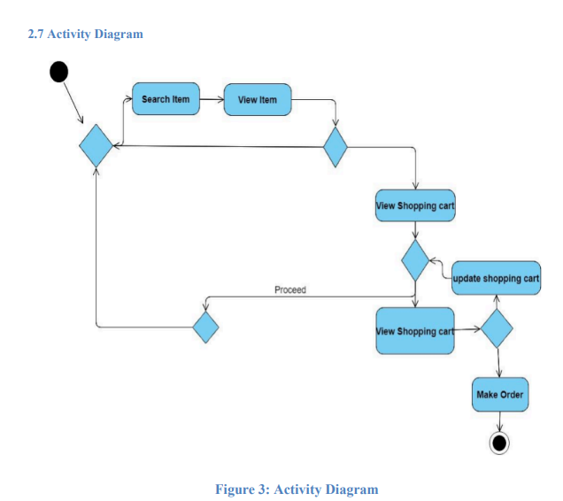
 
 
<b>ER-Diagram</b>
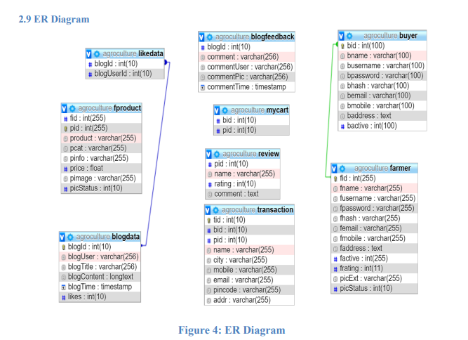

<b>Use Case Diagram</b>
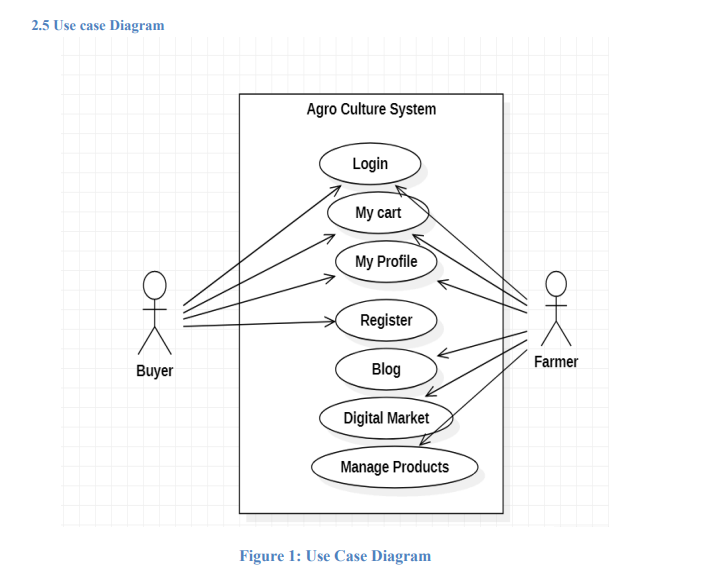

<b>Sequence Diagram</b>
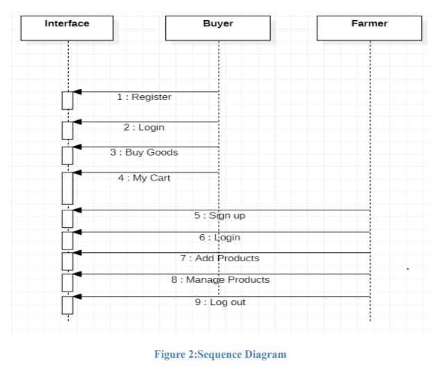

<b>Snapshots</b>

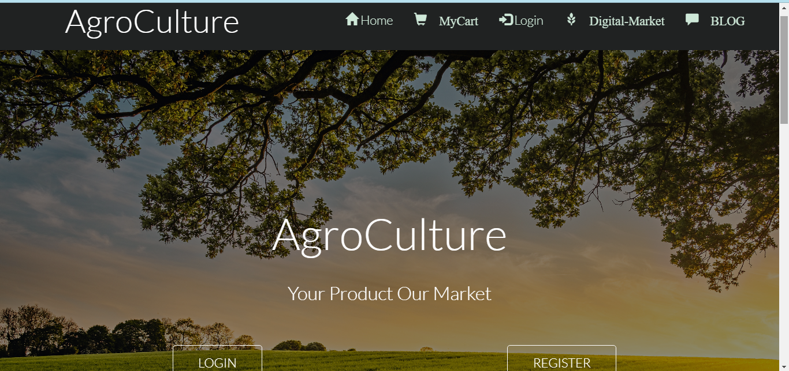
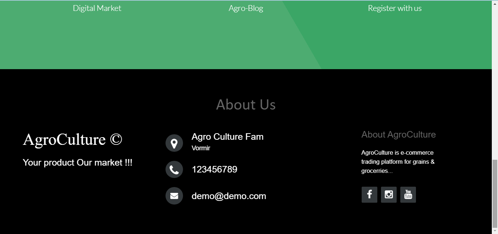

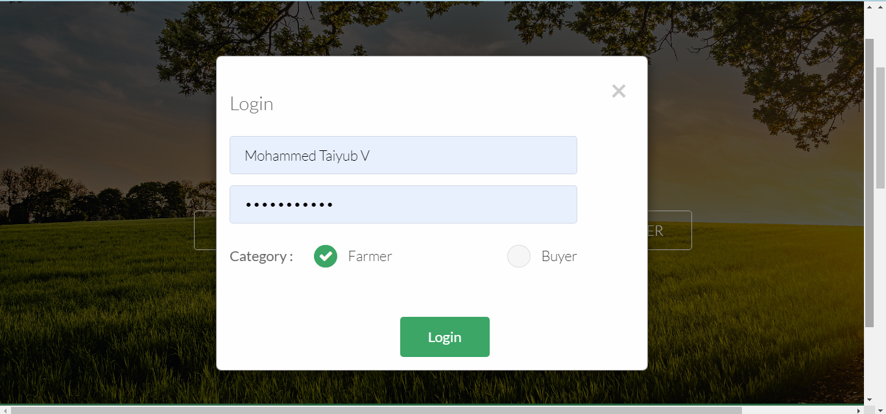

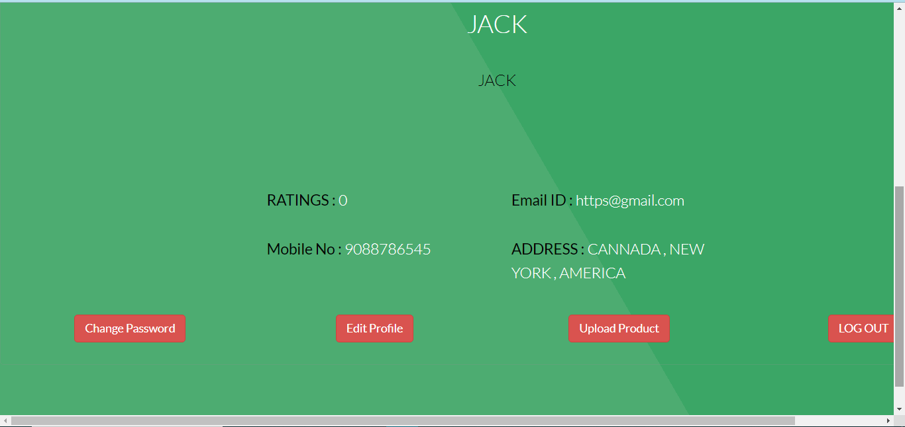

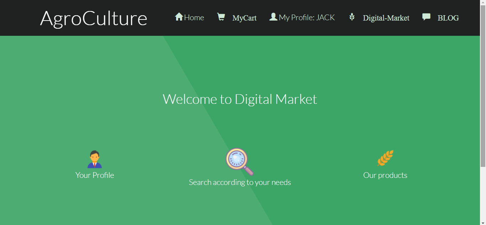

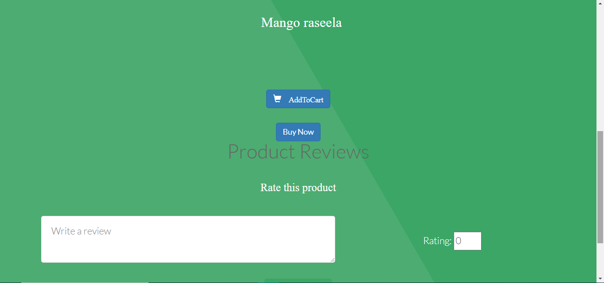

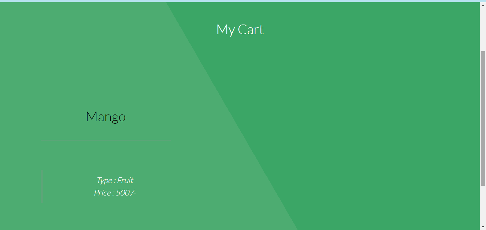

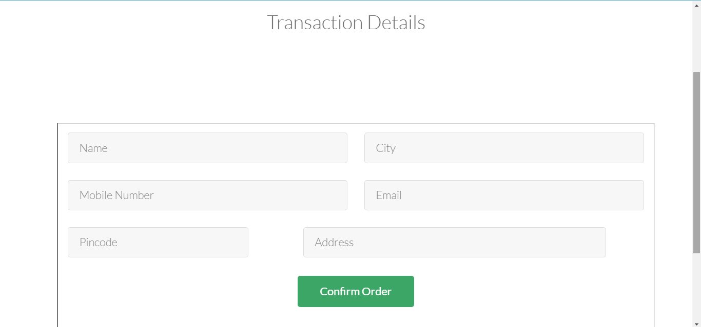

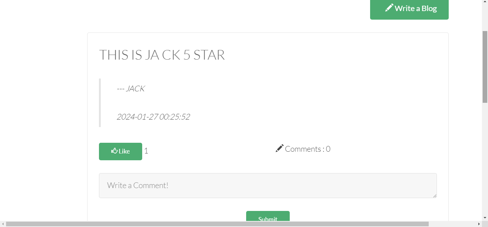

<b>How to run this project locally</b>
1. Download XAMPP server app and Install it in your desktop
2. clone this  repository in your system and copy repo and 1.go XAMPP folder ,2. htdox folder , then paste it in htdox folder
3. Open XAMPP control panel then 1.Click to Start apache Action , 2. Click to Start MySql Action and wait few seconds 3. Click Admin next to the start button in MySql Row it will redirect you to website 
4. click the New button in top left corner 1. Give the DB name as your saved project folder name copy it and paste it in DB name section 2 . click Create to create a new DB it will be created 
5. Go to  Import section in top middle of your website 1. click choose file button 2.Go to xampp  folder then go to htdox , 2.then open ur projrct like AgroCulture folder in that there will an agroculture.sql file add it, 3. scroll down and import it , 4. Queries will  be imported wait few mins then. 
5. Go to new web tab and type - /localhost/your project folder name / like eg- /localhost/agroculture/ you will get your website which is  successfully implemented and executed 

